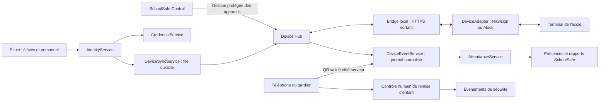

# SchoolSafe Device Hub — audit et proposition avant codage

Date : 16 septembre 2026. Statut : **PHASE 0 LIVRÉE — ARCHITECTURE À VALIDER**.
Référence auditée : `main`, `464996ed5e70957b199de5120b30f4cd6058aad8`.

Ce document constitue le premier livrable demandé au §56 de la mission du
propriétaire. Il conserve les exigences utiles et les preuves de l'audit, sans
copier la conversation. Aucun code applicatif, schéma SQL, équipement ou VPS
n'est modifié dans ce lot. **Attendre la validation avant le codage structurel.**

## Capacité et contraintes

Une école crée ses élèves et son personnel dans SchoolSafe, leur attribue une
identité stable et plusieurs moyens d'identification, puis synchronise les
personnes autorisées vers ses terminaux. Le Device Hub transporte les commandes
et les événements ; un service de présences distinct interprète les pointages.
Le téléphone du gardien reste utilisable si le terminal tombe en panne.

Règles imposées par la mission : SchoolSafe source de vérité ; isolation par
école ; refus par défaut ; aucun fichier biométrique dans SchoolSafe ; moyens
révocables ; événements conservés ; corrections tracées ; remise d'enfant
soumise à la photo de la personne autorisée et à la décision du gardien.

Ne font pas partie de ce chantier : paie, reconnaissance biométrique développée
par SchoolSafe, SchoolSafe Watch/GPS/SOS, commande automatique d'ouverture de
porte, nouveaux fournisseurs biométriques réels, modifications JASPE.

## 1. Branche actuelle

`main`. `git fetch origin main` exécuté au début de l'audit. HEAD local et
`origin/main` identiques : `464996ed5e70957b199de5120b30f4cd6058aad8`.
Le commit documentaire de cet audit aura son propre SHA dans Git.

## 2. État du dépôt

Aucun fichier suivi modifié au début de l'audit. Éléments non suivis préexistants :

- `.claude/` ;
- `ChatGPT Image 13 sept. 2026, 08_02_07 (1).png` ;
- `ChatGPT Image 13 sept. 2026, 08_03_44.png`.

Ils appartiennent à l'environnement et aux références du propriétaire ; ils
restent hors de ce lot. Aucune migration exécutée, aucun secret lu ou ajouté.

## 3. Derniers commits

| SHA | Contenu |
|---|---|
| `464996e` | JASPE se lève et explique au tableau de bord |
| `c019fc7` | Parcours vocal et interruption |
| `4bb6235` | Parole avec les deux mains |
| `b48ec07` | Poses assises animées |
| `78aa161` | Compagnon flottant, réponse sans historique |
| `e26ecef` | Barre mobile et panneau de conversation |
| `04ef0e0` | Handoff JASPE P4-ter |
| `b809149` | Chat fixe et bulle JASPE |

## 4. Documents consultés et limites de l'audit

Lecture complète de `AGENTS.md`, `docs/PROJECT_CONTEXT.md`, `docs/DECISIONS.md`,
`docs/CURRENT_HANDOFF.md` et de la mission jointe. Vérification du contrat de
licence dans `docs/superpowers/specs/2026-09-14-schoolsafe-license-service-entitlements-design.md`.
Lecture des schémas, services, routes, interfaces et tests cités ci-dessous.

L'audit porte sur **le dépôt et ses migrations versionnées**, pas sur un inventaire
SQL d'une base de production connectée. Aucun terminal ni firmware réel n'a été
interrogé. Les tests serveur exécutés utilisent des substituts de dépendances.
La preuve P5 de sauvegarde/restauration et le rejeu PostgreSQL restent à obtenir.

Contradictions à garder visibles :

- `AGENTS.md` demande de ne pas ajouter Docker ; les décisions du 14/09 parlent
  de Docker/Coolify. Ce lot ne touche pas au déploiement et ne tranche pas ce point.
- Les anciens handoffs marqués historiques ne prouvent pas que les parcours
  RH, retrait d'enfant ou présences sont raccordés au backend natif.
- Les exemples `SCH-AURORE-001` de la mission sont des **codes lisibles**. Conserver
  `school_id` UUID technique et `app.schools.code` comme code public existant.
- Le cadrage de ce nouveau chantier est autorisé. Il ne supprime pas les exigences
  P5 et de sécurité avant usage réel ; l'architecture proposée reste à approuver.

## 5. Architecture actuelle vérifiée

| Couche | État dans le code |
|---|---|
| Frontend | HTML/CSS/JavaScript ; modules métier, pages de démonstration et API natives coexistent |
| Serveur lancé | `server/src/index.ts` appelle `buildNativeApp` ; Fastify/TypeScript, PostgreSQL requis |
| Autorité humaine | Cookie de session → `requireAuthSession` → identité/profil/école résolus côté serveur |
| Accès SQL | `withRequestContext`, `withAuthorizedContext`, `api.check_access`, `iam.can_access` ; RLS forcée et RPC |
| Services natifs câblés | Élèves, session, configuration, finances, pédagogie, cartes, impression, licence, essai, JASPE |
| Sécurité historique | `server/src/security/*` et `events/*` utilisent Supabase ; `buildNativeApp` ne fournit pas `options.security` |
| Control | Clients et callbacks licence/impression présents ; aucune console complète « Appareils » trouvée dans ce dépôt |
| RH et biométrie | `app/modules/hr/hr-demo.js` : données fictives, `BACKEND_LATER`, pas d'enrôlement |
| Hors ligne navigateur | `app/offline-sync.js` : IndexedDB, séparation démo/serveur ; pas de Bridge matériel livré |

Preuves principales : `server/src/native-app.ts:22`, `server/src/app.ts:168`,
`server/src/authnative/middleware.ts:18`, `server/src/db/context.ts:21`,
`server/src/db/access.ts:19`, `database/baseline/v1/11_rls_acl.sql:6`,
`app/modules/hr/hr-demo.js:1`, `app/offline-sync.js:1`.

## 6. Tables existantes et réutilisation

| Tables versionnées | Utilité / décision |
|---|---|
| `app.schools`, `app.school_settings` | École UUID, code, configuration ; réutiliser |
| `app.students`, `app.student_enrollments`, `app.student_enrollment_events` | Identité scolaire et scolarité ; ne pas recréer les élèves |
| `app.student_guardians`, `app.parent_invitations` | Liens familiaux et personnes autorisées ; compléter le parcours réel et les photos |
| `iam.users`, `iam.profiles`, `auth.identities`, `auth.sessions` | Identité de connexion globale et profils scolaires ; ne pas les confondre avec une empreinte ou un StaffID |
| `auth.credentials` | Mots de passe des comptes ; ne pas y placer les PIN de pointage |
| `iam.devices` | Appareils de compte : `profile_id`, `device_key`, gestion école, révocation ; pas un registre de terminaux |
| `app.locations`, `app.security_portals` | Implantations et portails réutilisables ; éviter une table de sites parallèle au départ |
| `app.student_cards`, `app.card_print_requests` | Cartes physiques, cycle de vie et impression ; préserver et relier au credential opaque |
| `app.security_events` | Journal d'accès enfant, append-only ; conserver sa sémantique de sécurité |
| `audit.events`, `ops.system_events`, `ops.data_retention_policies` | Audit, événements métier, rétention ; réutiliser les tables, adapter les services natifs |
| `app.subjects`, `app.teacher_assignments` | **Matières scolaires** et affectations enseignants ; `subjects` ne désigne pas les personnes |

Aucune table métier persistante `staff`, `attendance`, `device_subject_mappings`
ou `subject_credentials` trouvée dans les migrations du dépôt. Le personnel
fictif de `hr-demo.js` n'est pas une table de production. Le rôle `hikvision_admin`
existe mais n'accorde que des droits génériques et `staff.attendance.read` ; il
ne prouve aucune intégration matérielle.

Sources : `database/baseline/v1/04_app_tables.sql:103`, `:123`, `:205`, `:228`,
`:243`, `:431` ; `05_iam.sql:17` et `:32` ; `06_audit_ops.sql:6` ;
`database/auth/v1/01_auth_tables.sql:20` ; `database/access/v1/01_role_templates.sql:165`.

## 7. Fonctions et composants réutilisables

- `createSetupNativeService` : création d'école existante, à conserver sous
  l'autorité Control/configuration autorisée, sans créer une école depuis un terminal.
- `createStudentsNativeService.readStudent/listStudents/createStudentDraft` et
  `SchoolSafeSchoolNativeAPI` : point d'entrée natif pour les élèves.
- `requireAuthSession`, `withRequestContext`, `withAuthorizedContext`,
  `iam.require_access` : socle des futures routes humaines, avec cibles réelles.
- `audit.write_event` et `audit.events` : audit humain transactionnel. Prévoir une
  variante machine bornée, car la fonction actuelle exige un contexte humain valide.
- `app/modules/security/security-module.js` : interface scanner et caméra
  `BarcodeDetector`, arrêt des pistes vidéo. Conserver l'ergonomie, remplacer
  le raccordement historique et ajouter un décodeur local de secours si nécessaire.
- Cycle de carte et d'impression existant : garder demandes, versions et historique.
- `ops.system_events` : sortie transactionnelle pour les notifications ; adapter
  le service natif, le service Supabase actuel écrit `user_id` alors que la table
  canonique porte `actor_profile_id`.
- `verifyControlSignature` : exemple de séparation humain/machine, **pas une
  authentification Bridge prête à réutiliser**. Le callback actuel resérialise
  le JSON et n'est pas un contrat de principal machine limité à une école/appareil.

## 8. Écarts et défauts importants constatés

| Écart | Conséquence pour le plan |
|---|---|
| Aucun Device Hub/adaptateur/Bridge ni modèle RH persistant | Fondations à créer avant de brancher les écrans |
| Aucun service de présence canonique | Ne pas convertir directement un événement Hikvision en état RH dans l'adaptateur |
| QR historique signé mais lisible | `SS-${schoolCode}-${matricule}-${issuedAt}` n'est pas opaque ; format V2 requis |
| Le service historique stocke `qr_payload` dans les métadonnées | À retirer du futur journal ; journaliser une référence, jamais le secret QR |
| Le scan historique n'accepte pas le contexte scolaire de l'appelant | Filtre explicite + autorisation de la ressource à refaire dans le chemin natif avant activation |
| `manual_override` historique peut accepter une sortie sans personne vérifiée | Ne pas reprendre ce mécanisme dans le parcours enfant |
| Photo de la personne autorisée absente du schéma canonique et de la projection historique | Migration + contrôle serveur photo/version/confirmation nécessaires |
| Ancien client scanner omet `location_id`, requis par son schéma serveur | Raccordement à reconstruire et tester, pas seulement changer l'URL |
| Serveur de prévisualisation : `camera=()` | Autorisation caméra ciblée `self` et tests mobile à prévoir ; pas d'ouverture générale |
| Licence actuelle : vérification générale de l'état, pas de contrat Device Hub | Décider les services concernés et le traitement des événements en attente |
| SQL élève : `student_create_draft` insère `status='planned'`, contrainte canonique limitée à `draft/active/completed/cancelled` | Incompatibilité textuelle vérifiée ; corriger et rejouer avant le flux élève → terminal |
| Signature SQL de cette même RPC contient des paramètres par défaut avant d'autres requis | Revue/rejeu PostgreSQL obligatoire ; les tests substitués ne prouvent pas l'application de ce SQL |

Le service historique de sécurité utilise un client de service et contient des
requêtes sans école de l'appelant ; c'est un **risque de réutilisation**, pas une
affirmation de fuite observée sur le serveur natif actuellement câblé.

Preuves : `server/src/security/service.ts:208`, `:244`, `:273`, `:298`, `:422` ;
`server/src/security/schema.ts:5` ; `app/modules/security/security-module.js:272` ;
`app/server.mjs:50` ; `database/projections/v1/02_student_list.sql:101` ;
`database/baseline/v1/07_constraints_indexes.sql:124`.

## 9. Architecture Device Hub proposée

Choix proposés : modules dans le serveur existant et worker de synchronisation,
une base par environnement, pas de backend par école/appareil. Adaptateur
Hikvision exécuté dans le Bridge lorsque le terminal est sur le réseau privé ;
même contrat possible côté serveur si une liaison sécurisée est réellement disponible.
Le navigateur ne contacte jamais l'IP du terminal ni ses secrets.

Les commandes sont persistées avant exécution. Aucun appel réseau à un terminal
ne doit retenir une transaction SQL. Identité, souhait de synchronisation et audit
sont enregistrés atomiquement ; un worker transmet ensuite le travail.

Interfaces proposées : `DeviceService`, `IdentityService`, `CredentialService`,
`DeviceSyncService`, `DeviceEventService`, `AttendanceService`, façade native
`AuditService`. `DeviceAdapter` expose connexion/info/capacités/santé, personnes,
PIN/cartes, statut d'enrôlement et événements. Une opération non supportée renvoie
`unsupported`, jamais un faux succès. Les commandes autorisées sont fermées :
aucun shell distant ni URL libre fournie par le terminal.

Autorités distinctes :

- Humain école : école de session, permission et portée de ressource vérifiées.
- Opérateur Control : choix d'école autorisé par Control, pas un `school_id`
  imposé par un administrateur scolaire. Console complète à raccorder dans le
  dépôt Control lorsqu'il sera identifié.
- Bridge : principal propre, révocable, borné à une école et une liste d'appareils.
  Pas de profil humain fictif et aucun droit général sur les élèves.

## 10. Schéma de données proposé

Noms ci-dessous **proposés**, aucune table créée dans ce lot. Toutes les nouvelles
tables métier portent `school_id NOT NULL` et des clés étrangères composites
`(school_id, référence)` ; UUID internes et codes publics séparés.

| Table / extension | Champs et contraintes essentiels |
|---|---|
| `app.staff` | `id`, école, code StaffID, noms, état, `profile_id` facultatif ; le salarié n'a pas besoin d'un compte de connexion |
| `app.subject_identities` | `id`, école, type, `student_id` OU `staff_id`, état ; CHECK exactement une cible, FK réelles et unicité par cible ; aucune copie des noms |
| `app.subject_credentials` | `id`, identité, type, état, dates, version, référence ou digest selon type ; aucune valeur secrète dans les lectures ordinaires |
| `app.credential_secrets` | Si nécessaire : secret chiffré par enveloppe, version de clé, accès machine ciblé ; rôle SQL séparé de la lecture métier |
| `app.school_identification_policies` | QR/PIN/biométrie élèves, version, auteur, dates ; biométrie élèves désactivée par défaut |
| `app.biometric_authorizations` | Référence à l'identité enfant, décision et version de politique applicables, révocation ; aucune empreinte |
| `devicehub.devices` | UUID/code, école, emplacement/portail, vendeur/modèle/série/firmware, protocole, connexion, état, dernières communications/synchronisations |
| `devicehub.device_capabilities` | Appareil, capacité, état `unknown/supported/unsupported`, preuve documentaire ou probe, firmware et date |
| `devicehub.device_auth_config` | Appareil, référence de coffre/secret chiffré, version ; aucune API de lecture du mot de passe |
| `devicehub.bridges` | École, principal machine, clé publique/certificat ou référence, état, révocation, dernière communication |
| `devicehub.device_subject_mappings` | École, appareil, identité, `external_person_id`, génération, état de sync, révision voulue/appliquée, état/date d'enrôlement |
| `devicehub.device_sync_jobs` | Mapping, opération, révision, clé d'idempotence, état, tentatives, prochaine tentative, bail et erreur expurgée |
| `devicehub.device_events` | Journal source immuable : école, appareil ou source mobile, ID fournisseur, époque du journal, identité externe, méthode, type, heures, métadonnées autorisées |
| `devicehub.event_processing` | Résolution du mapping, identité SchoolSafe, état, erreur, version de traitement ; distinct du journal original |
| `devicehub.device_cursors` | Curseur durable par appareil/flux/époque, dernier acquittement ; déplacement après commit uniquement |
| `app.attendance_policies` | Horaire, fuseau IANA, calendrier, tolérance, population et version avec date d'effet |
| `app.attendance_records` | Identité, jour/service attendu, arrivée, départ, état et version calculée ; unicité sur le service attendu |
| `app.attendance_event_links` | Provenance entre événements source et présence ; chaque événement ne s'applique qu'une fois par version de calcul |
| `app.attendance_corrections` | Ajouts append-only : cible, auteur, motif obligatoire, valeurs avant/après, date, version corrigée |
| Extensions Guardian | Photo/version sur `app.student_guardians`, état/validité d'autorisation ; preuve de confirmation dans un événement append-only |

`device_health` séparée n'est pas nécessaire en V1 : état courant dans `devices`,
changements et erreurs dans l'audit. Les tables `schools`, `students`, parents,
cartes et audit existantes ne sont pas dupliquées.

Contraintes complémentaires : unicité du numéro externe dans un appareil et sa
génération ; unicité du mapping actif identité/appareil ; série affectée à une
seule école active sous contrôle de Control ; aucune réaffectation silencieuse.
Les relations carte/mapping/credential/événement ne peuvent pas traverser les
écoles, même si l'API reçoit des UUID valides d'une autre école.

L'identité `subject_identities` est une **liaison technique vers la personne
existante**, pas une seconde fiche civile. Aucune fusion automatique d'enfants
ou de salariés entre écoles. L'authentification adulte globale reste inchangée.

## 11. Stratégie Hikvision

Première cible : **DS-K1T808MFWX**, sans la confondre avec la variante `-B`.

La fiche officielle indexée du modèle exact indique empreinte, carte M1, PIN,
ISAPI/ISUP 5.0, Ethernet/Wi-Fi, 3 000 cartes, 3 000 empreintes et 100 000 événements.
Ces capacités commerciales ne prouvent pas les commandes exposées par l'appareil
installé. [Fiche officielle DS-K1T808MFWX](https://assets.hikvision.com/prd/public/all/doc/m000141791/DS-K1T808MFWX_Datasheet_20240424.pdf).

Une note officielle de la série mentionne des changements de collecte distante
d'empreintes et des contraintes d'intégration logicielle. Cela confirme la
nécessité de qualifier le firmware ; cela ne démontre pas qu'un enrôlement distant
ISAPI sans extraction du gabarit est disponible pour SchoolSafe.
[Note de version de la série](https://assets.hikvision.com/prd/public/all/files/202503/releasenote%5CDS-K1T808_Series_Terminal_V3.25.0_build241227_Release_Note.pdf).

Consultation via recherche officielle le 16/09/2026 : extraits indexés accessibles ;
ouverture directe de la fiche retournant 403 et de la note expirant en délai.
Aucune inspection complète de ces PDF ni validation matérielle n'est revendiquée.
Le [portail développeur Hikvision](https://tpp.hikvision.com/download/) annonce des
guides par modèle et un accord préalable pour leur téléchargement. Aucun accord
n'a été accepté au nom du propriétaire.

| Fonction | Position avant qualification |
|---|---|
| Empreinte / PIN / carte | Matériel documenté ; fonctionnement et format événement à tester |
| QR terminal / visage | Désactivés dans SchoolSafe faute de preuve ; QR téléphone indépendant |
| Synchronisation distante des personnes/PIN | À confirmer par guide du modèle et requêtes réelles contrôlées |
| Journal, pagination, événements temps réel | Transport et commandes exactes à confirmer |
| Enrôlement distant | Désactivé tant que le flux et la non-extraction du gabarit ne sont pas prouvés |

Protocole de qualification phase 7 : relever modèle exact et firmware ; obtenir
la documentation officielle applicable ; lire identité/capacités/heure ; créer
une personne fictive autorisée ; vérifier mise à jour/désactivation et comportement
après réponse réseau perdue ; affecter un PIN de test ; vérifier événement/ID/méthode/
direction ; tester pagination et reconnexion ; documenter enrôlement local et
lecture du statut. Ne jamais importer les utilisateurs du terminal comme source
de vérité : les comptes préexistants vont en rapprochement manuel.

**Aucune URL d'API Hikvision ni commande non vérifiée n'est spécifiée ici.**
ISAPI via Bridge est le candidat de départ ; ISUP reste une option à qualifier,
pas une dépendance imposée ni un service cloud fournisseur supposé disponible.

## 12. Stratégie QR

Proposition : jeton opaque aléatoire à forte entropie (32 octets), versionné,
indépendant du nom, du matricule, du numéro externe et du code école. Conserver
son digest pour la résolution ; vérifier état, version, expiration éventuelle,
école et permission avant toute projection nominative.

Émettre/remplacer/révoquer sans recréer la personne. Pour l'impression ou la
réimpression autorisée, conserver le secret uniquement dans un coffre chiffré
ou réémettre un nouveau credential ; un hash seul ne permet pas de reconstruire
le QR. L'artifact imprimable doit lui aussi être protégé et accessible brièvement.

Un QR statique peut être copié : la signature éventuelle ne le rend pas à usage
unique. Idempotence de requête + consolidation de passages rapprochés, sans
interdire les scans légitimes des jours suivants. Un QR ne vaut jamais preuve
de remise à un adulte. Aucun secret QR dans URL réseau, logs, exports de diagnostic
ou stockage navigateur durable non protégé.

Migration : inventaire des cartes existantes, double lecture transitoire bornée
si validée, émission V2, révocation/remplacement tracés ; aucune invalidation
massive silencieuse. La carte physique et le credential restent liés mais distincts.

## 13. Stratégie PIN

Séparer PIN de pointage et mot de passe du compte. Le PIN du terminal n'ouvre
aucune session SchoolSafe. Création/remplacement/révocation sous permission
dédiée, restitution ponctuelle autorisée, jamais dans l'audit ou les jobs en clair.

**Un hash ne suffit pas pour envoyer un PIN au terminal.** Si l'API l'exige,
prévoir un secret chiffré par enveloppe récupérable uniquement par le worker/Bridge
autorisé, le temps nécessaire à sa transmission. Le job ne porte qu'une référence.
Si une vérification serveur est prévue plus tard : hash lent adapté et limitation
des essais ; le chiffrement pour la synchronisation et le hash de vérification
répondent à deux usages distincts.

Longueur, caractères, saisie « ID + PIN » ou PIN seul et nombre d'essais dépendent
du firmware. Ne pas promettre un verrouillage serveur pour des essais effectués
hors ligne uniquement sur le terminal. Rotation multi-appareils avec révision
voulue/appliquée ; afficher une révocation encore en attente sur appareil offline.

## 14. Stratégie empreinte

Reconnaissance et gabarit restent sur l'équipement. SchoolSafe conserve identité,
mapping, état d'enrôlement, date, source de preuve et éventuelle référence non
biométrique. Aucun gabarit, image de doigt ou blob fournisseur dans les événements,
la file, la sauvegarde ou les logs.

La personne est créée dans SchoolSafe et synchronisée d'abord ; elle pose ensuite
son doigt au terminal. Si le statut n'est pas lisible par API : afficher
`unknown` ou une attestation opérateur distincte, pas `verified_enrolled`.
Un terminal remplacé peut nécessiter un **nouvel enrôlement physique** même si
l'identité SchoolSafe est inchangée. Pas de copie des gabarits entre terminaux
dans ce périmètre.

États : `not_enrolled`, `pending`, `enrolled`, `failed`, `unknown`,
`revocation_pending`, `revoked`. Désactivation d'une personne déclenche la
désactivation et, selon politique applicable, la suppression biométrique sur
chaque appareil, avec acquittement vérifié ; les preuves administratives restent.

## 15. Stratégie élèves et famille

Réutiliser `student_id`, scolarité et liens `student_guardians`. Pas de compte
autonome créé pour l'enfant. Plusieurs enfants par parent et plusieurs tuteurs
autorisés par enfant restent possibles ; aucune assimilation parent = credential.

La création native actuelle est un brouillon. Ne synchroniser que les élèves
éligibles après validation de leur statut et du rattachement scolaire ; compléter
le flux d'admission et les liens familiaux avant de l'annoncer opérationnel.
La RPC native simplifiée et la RPC d'admission plus complète existante doivent
être rapprochées, avec tests réels de leurs contrats ; pas de troisième flux.

Biométrie désactivée par défaut. Activation par école + décision individuelle
autorisée et traçable, modalités d'information/consentement et rétention à valider
avant pilote enfant. Ce document ne conclut pas à une conformité juridique.
QR/PIN restent possibles sans empreinte selon la politique retenue. Un retrait
d'autorisation biométrique n'efface pas le dossier scolaire.

## 16. Stratégie personnel

Créer un référentiel `app.staff` minimal, avec un StaffID stable, relié à un
profil existant lorsqu'il y en a un. Ne pas transformer tous les salariés en
comptes connectés. Les affectations pédagogiques existantes restent liées aux
profils ; prévoir le rapprochement sans changer leurs identifiants.

Création autorisée → fiche et identité → QR/PIN selon politique → choix des
terminaux → jobs durables → mapping confirmé → enrôlement physique éventuel.
Si le terminal est offline, l'enregistrement SchoolSafe réussit avec sync en attente.
Un salarié inactif conserve son historique ; les credentials sont suspendus et
les commandes de désactivation envoyées à tous ses terminaux. Paie exclue.

## 17. Événements, mappings et idempotence

Contrat normalisé : `event_id`, école dérivée de l'autorité machine/humaine,
appareil/source, identifiant fournisseur, époque du journal, personne externe,
identité SchoolSafe résolue, méthode, type, `occurred_at`, `received_at`, fuseau/
offset source et qualité d'horloge. Le fournisseur ne peut pas choisir un autre
`school_id` ni imposer librement un `student_id`.

Méthodes : `fingerprint`, `pin`, `card`, `qr`, `unknown`. Types : `check_in`,
`check_out`, `authentication`, `access`, `unknown`. Le sens n'est pas inventé à
partir de l'heure ni alterné entrée/sortie à chaque scan.

Deux mécanismes distincts :

1. **Doublon transport** : unicité `(school_id, device_id, source_epoch,
   raw_provider_event_id)` quand l'ID est fiable. Sinon clé documentée issue
   d'une séquence/curseur fournisseur vérifié ; un simple timestamp peut fusionner
   deux événements réels. Le Bridge attribue un ID durable avant tout retry.
2. **Passages rapprochés réels** : conserver les quatre événements distincts,
   puis consolider une seule arrivée dans AttendanceService selon sa politique.

Mapping absent/ambigu, type inconnu, horloge douteuse : événement mis en attente
ou en anomalie, aucune présence devinée. Un ID externe ne doit pas être réaffecté
silencieusement à une autre personne. Réinitialisation/remplacement du terminal :
nouvelle époque et mappings versionnés ; les anciens pointages gardent leur lien.

« Brut » signifie fait source conservé, **pas copie intégrale du payload** :
liste blanche des champs, exclusion des PIN/QR/gabarits/images, taille bornée.
Les corrections et états de traitement n'altèrent jamais l'original.

## 18. Présences, sorties et rapports

AttendanceService applique calendrier, statut de la personne, horaires et fuseau
de l'école, tolérance et version de règle applicable à la date du pointage.
Exemple sans tolérance : arrivée 07:42 pour 07:30 → présent, retard 12 minutes.
Un événement d'authentification sans direction reste à qualifier par une règle
explicitement configurée (appareil/portail dédié ou mode terminal vérifié).

Consolider sous transaction/verrou identité + service attendu afin que deux
terminaux simultanés ne créent pas deux arrivées. Conserver plusieurs intervalles
si la politique autorise plusieurs entrées/sorties. Les absences exigent un
calendrier et une population attendue ; pas de scan ne signifie pas automatiquement
absence pendant une panne ou avant la fin de collecte.

Événement tardif : recalcul déterministe avec provenance. Une correction humaine
existante n'est jamais écrasée ; créer une proposition/anomalie et conserver auteur,
motif, date et valeurs. Notifications et rapports sont idempotents ; un rejeu ne
doit pas envoyer une seconde alerte parent pour le même fait.

Pour l'enfant, distinguer **pointage de sortie** et **remise autorisée**. Une
empreinte/PIN/QR peut signaler une demande ou un passage ; aucune remise n'est
validée sans personne active autorisée, photo disponible, comparaison physique
et confirmation explicite du gardien, sous `security.pickup.manage` et portée
portail. Revalider l'autorisation et la version de photo au commit. Le terminal
ne contourne ni ce contrôle ni le verrouillage de sécurité.

Rapports SchoolSafe : jour, période, classe, élève, personnel, arrivées/départs,
retards, absences confirmées et anomalies ; portées limitées et exports audités.

## 19. Offline, reprise et remplacement

Trois pannes différentes :

| Panne | Comportement attendu |
|---|---|
| Terminal indisponible, serveur joignable | QR téléphone validé par SchoolSafe ; autres fonctions continuent |
| Internet de l'école indisponible | Terminal peut continuer si configuré ; Bridge conserve une file locale chiffrée et bornée |
| Téléphone hors ligne | Capture éventuellement en attente ; aucune prétention de validation centrale actuelle ni de remise autorisée |

Un QR opaque nécessite normalement le serveur pour résoudre l'identité. Une vraie
validation autonome du téléphone demanderait un mécanisme séparé de justificatifs
signés et de révocation bornée ; **non incluse par défaut** dans la V1 proposée.
Le mode humain d'urgence reste une procédure d'école à définir, pas une autorisation
automatique inventée par l'application.

Bridge léger sur poste toujours disponible (OS et matériel à confirmer), HTTPS
sortant avec identité propre, sans ouvrir l'interface terminal sur Internet.
Spool durable chiffré, acquittement après commit serveur, reprise après redémarrage,
backoff avec jitter, baux de travail, plafond de tentatives et traitement manuel
des erreurs permanentes. Réserve disque/retention/alertes : jamais purger
silencieusement des événements non acquittés. Pas de scan réseau automatique large.

Synchronisation : `pending → syncing → synced`, échec transitoire `retrying`,
échec permanent `failed`, abandon/désactivation `disabled`. Une révision obsolète
ne doit pas réactiver une personne révoquée. Réponse réseau perdue après création :
relire/rapprocher l'utilisateur externe avant de recréer. Remplacement : nouveau
device_id, mêmes identités, mappings neufs, ancien appareil révoqué et éventuel
réenrôlement ; conserver le journal historique.

## 20. Tests et preuves

### Exécutés pendant cet audit

| Commande | Résultat réel |
|---|---|
| `node --test scripts/permission-contract.test.mjs scripts/cross-school-static.test.mjs` | **4/4 PASS** |
| `node scripts/check-migration-versions.mjs` | **9 ensembles / 27 unités PASS** |
| `npm run test --workspace server -- tests/db-context.test.ts tests/native-access-contract.test.ts tests/studentsnative.test.ts tests/security.test.ts tests/security-service.test.ts tests/control-authority.test.ts tests/licensenative-gate.test.ts` | **7 fichiers / 41 tests PASS** |
| Recherches schémas/câblage/contrats et comparaison Git | Éléments ci-dessus confirmés dans le dépôt |

Les contrôles de hash ne valident pas la syntaxe ni l'exécution du SQL. Le sweep
d'isolation SQL ne couvre pas automatiquement chaque ancien accès Supabase. Ces
tests verts ne corrigent pas les incohérences de §8 et ne prouvent ni terminal
réel, ni RLS sur PostgreSQL connecté, ni caméra réelle.

### Matrice à livrer avec les phases d'implémentation

| Domaine | Cas obligatoires |
|---|---|
| Isolation | A ne lit/commande jamais appareil, credential, mapping, événement, rapport de B ; appels RPC directs et FK composites |
| Permissions | Sans session, mauvaise permission/portée, Control vs école, Bridge révoqué, aucun SQL avant authentification machine |
| Identités | Création répétée idempotente, personnel sans compte, enfant sans compte autonome, changements de statut |
| QR/PIN | Révocation/rotation/expiration, mauvais tenant, logs expurgés, PIN jamais exporté, doublons de requêtes et secret chiffré |
| Biométrie | Politique enfant désactivée, autorisation retirée, blobs fournisseur rejetés, statut inconnu honnête, effacement terminal en attente |
| MockDeviceAdapter | Online/offline, personnes, empreinte/PIN, doublon, timeout avant/après création, panne, reconnexion, conflit de version |
| Jobs | Bail expiré, crash, retry, aucun doublon personne, désactivation prioritaire, multi-device, remplacement/reset |
| Événements | Doublon transport, quatre scans réels, mapping inconnu, horloge fausse, ID réutilisé, événement tardif, ordre inversé |
| Présences | Retard, calendrier, absence en panne, plusieurs intervalles, multi-terminal concurrent, correction préservée, rapports scopés |
| Enfants / Guardian | Photo absente, adulte révoqué, confirmation manquante, changement entre affichage et validation, QR seul refusé |
| SQL / migrations | Base vide et mise à niveau, rollback applicatif, RLS humain/machine, restauration réellement exécutée avant pilote |
| E2E | Personnel/élève → sync → événement → présence ; panne terminal → QR ; console Control/école ; mobile et caméra réels |

La phase 18 renforce une sécurité déjà présente ; l'isolation, le chiffrement et
l'idempotence ne doivent pas attendre la fin du projet.

## 21. Risques et décisions encore ouvertes

| Sujet | Proposition / décision attendue |
|---|---|
| Matériel | Modèle exact, firmware, accès autorisé au LAN et compte technique à renseigner via un canal secret, jamais dans le document |
| Hébergement Bridge | Confirmer poste Windows/Linux toujours disponible et stratégie de mise à jour ; ne pas acheter de matériel sur cette seule proposition |
| Chiffrement | Coffre/enveloppe par école, séparation des rôles, sauvegarde et rotation des clés ; perte de clé = resynchronisation/réémission |
| Biometrie enfant | Activation facultative, politique et autorisations traçables ; examen des obligations locales avant activation réelle |
| Capacité / volumes | 3 000 empreintes documentées ne signifient pas 3 000 personnes à plusieurs doigts ; vérifier volumes, débit et rétention utiles |
| Horaires / sens | Fuseau par école, tolérance, calendrier, entrée/sortie, consolidation ; valeurs à faire définir par chaque école |
| Licence | CORE identité accessible ; association Device Hub/StaffID/Pass à valider. Ingestion/revocations et traitement en cas de licence suspendue doivent avoir un contrat explicite |
| Control | Identifier le dépôt/contrat de console réelle ; les clients d'impression présents ne suffisent pas à annoncer l'écran Appareils livré |
| Ancien QR | Fenêtre de compatibilité et campagne de remplacement à choisir, sans effacer les cartes/historiques |
| Connexion terminal | Authentification et TLS réellement supportés à vérifier ; si nécessaire réseau local isolé/liaison privée, jamais ignorer un certificat silencieusement |
| Sécurité physique | Un terminal avec relais peut ouvrir une porte indépendamment du logiciel ; aucune ouverture automatique de sortie enfant dans ce lot |
| Pré-requis dépôt | Réparer le contrat SQL élève, rendre Guardian natif et vérifier P5 avant un pilote réel |

Proposition d'API métier : `/native/devices`, `/native/identities/:id/credentials`,
`/native/staff`, `/native/device-events`, `/native/attendance`, commandes de sync
idempotentes renvoyant `202 + job_id`. L'école provient de la session. Les routes
Bridge et Control utilisent une authentification machine distincte ; aucun bypass
générique du hook de licence. Ces chemins sont internes proposés, pas des API Hikvision.

Permissions proposées à valider : `devices.read/manage/sync`,
`credentials.issue/revoke`, `biometrics.enroll`, `student.attendance.read`,
`attendance.correct`. Réutiliser `staff.read/manage`, `staff.attendance.read` et
les permissions Guardian existantes quand leur portée convient. Aucun grant
automatique à tout administrateur et aucun enrichissement de permission par JASPE.

## 22. Fichiers à modifier ou créer après validation

| Lot | Surfaces proposées |
|---|---|
| Fondations | `database/devicehub/v1/`, `database/identity/v1/`, `database/attendance/v1/` ; unités complémentaires Guardian et corrections de projection |
| Services | `server/src/devicehub/` (types, services, jobs, événements, adapters), `identitynative/`, `staffnative/`, `attendancenative/`, `securitynative/` |
| Autorité | `server/src/db/` pour le contexte Bridge borné, `authnative/middleware.ts` réutilisé, `access/` et catalogue commun |
| Raccordement | `server/src/app.ts`, `native-app.ts`, `studentsnative/`, audit/événements natifs, gate de licence selon décision |
| Bridge | `device-bridge/` proposé, runtime léger et installation native documentée ; pas de Docker ajouté |
| Frontend | `app/modules/devices/`, `hr/`, `school/`, `security/`, clients API natifs, `app/index.html`, `app/app.js`, styles, cache |
| Caméra | `app/server.mjs` et politique de réponse du serveur réellement déployé |
| Control | Écran Appareils et wizard dans le dépôt Control à identifier ; contrat séparé dans ce dépôt |
| Tests / CI | `server/tests/`, tests SQL, scénarios navigateur ; `scripts/check-migration-versions.mjs`, tests et manifestes de nouveaux ensembles |
| Exploitation | `ops/device-bridge/`, qualification matériel, restauration, diagnostic expurgé, runbook de révocation/remplacement |

Propriété des fichiers critiques à verrouiller au début de chaque lot si un autre
assistant intervient en parallèle. Aucune suppression de module historique sans
migration et demande explicite.

## 23. Migrations nécessaires

1. Rejeu de la baseline et correction additive du contrat élève ; vérifier les
   signatures, statuts, cibles Access Law et liens parent/enfant réellement raccordés.
2. Fondations personnel/identité et registre de terminaux/Bridge : contraintes
   composites, privilèges, RLS, index et autorité machine étroite.
3. Credentials et secrets séparés, politiques enfant, mappings et jobs versionnés.
4. Journal d'événements/cursors/traitement et commandes idempotentes.
5. Politiques, présences, provenance et corrections ; enrichissement Guardian/photo.
6. Liaison carte → credential V2 et migration progressive, sans rupture des cartes existantes.

Ajouter des ensembles/unités de migrations versionnés et leurs manifestes.
Ne pas réécrire silencieusement une baseline déjà appliquée. Si une unité actuelle
ne s'applique pas sur base vide, produire un correctif explicite et une stratégie
de compatibilité distincte des nouvelles migrations, avec preuve sur les deux cas.

Backfills déterministes : une identité par dossier existant, aucune création de
personne depuis un terminal, rapprochement contrôlé des salariés/profils. D'abord
ajouts et contrôles, puis activation progressive par école/appareil. Retour arrière
applicatif par désactivation des nouvelles fonctions, conservation des journaux et
restauration testée ; pas de `DROP` destructif comme mécanisme de rollback.

## 24. Plan d'implémentation et arrêt pour validation

Ordre demandé conservé, avec les prérequis identifiés par l'audit :

| Phase | Livraison et condition de sortie |
|---|---|
| 0 | Présent audit, tests existants et écarts ; **terminé, validation attendue** |
| 1 | Contrat d'identité, DeviceAdapter, permissions, menace, licence et architecture validés ; zéro commande matérielle inventée |
| 2 | Registre/managers, fondations minimales staff/identité, RLS et contexte machine ; migrations rejouées |
| 3 | Credentials QR/PIN/références, chiffrement, politique élèves ; tests de révocation et de secrets |
| 4 | Mappings versionnés et identifiants externes stables ; multi-appareils sans doublons |
| 5 | MockDeviceAdapter avec défaillances contrôlées |
| 6 | Contrats Hub, permissions, isolation, idempotence et jobs verts avant matériel |
| 7 | Qualification du modèle/firmware, matrice de preuves, HikvisionAdapter limité aux capacités vérifiées |
| 8 | Fiche personnel persistante → identité → job → terminal ; état de sync honnête |
| 9 | Admission élève corrigée/raccordée → famille → identité → sync selon politique |
| 10 | PIN et enrôlement physique, statut réel, désactivation vérifiable |
| 11 | Réception/récupération et normalisation des événements ; journal durable |
| 12 | AttendanceService, règles versionnées, consolidation/corrections/rapports |
| 13 | QR téléphone natif + Guardian réel/photo/confirmation ; mode panne terminal éprouvé |
| 14 | UI appareils : Control et vue école autorisée ; wizard école/marque/modèle/connexion/capacités/enregistrement |
| 15 | UI Identification personnel, credential et sync |
| 16 | UI Identification élève et liens familiaux, aucune autonomie administrative enfant |
| 17 | Validation complète offline/retry/Bridge, panne réseau, redémarrage et remplacement |
| 18 | Durcissement et revue finale des secrets, accès, rejeu, rétention et limites |
| 19 | E2E, caméra/terminal réels, P5 restaurée ; pilote une école puis extension |

La persistance et l'idempotence sont conçues dès les phases 2–6 ; la phase 17
valide leur exploitation complète, elle ne les ajoute pas après coup.

**Prochaine action exacte après accord : phase 1**, figer les contrats et critères
de test, puis lot 2 limité aux fondations. Aucune estimation en jours défendable
avant qualification du firmware, du Bridge et du périmètre Control. Le mock permet
d'avancer sans matériel ; il ne permet pas de déclarer l'intégration Hikvision terminée.

**STOP — attendre la validation du propriétaire avant les modifications structurelles.**
